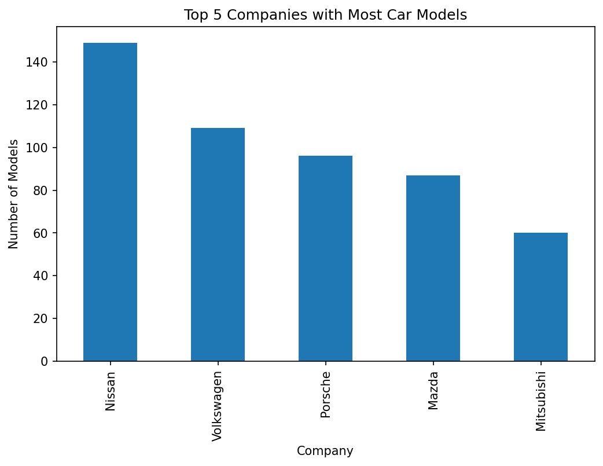
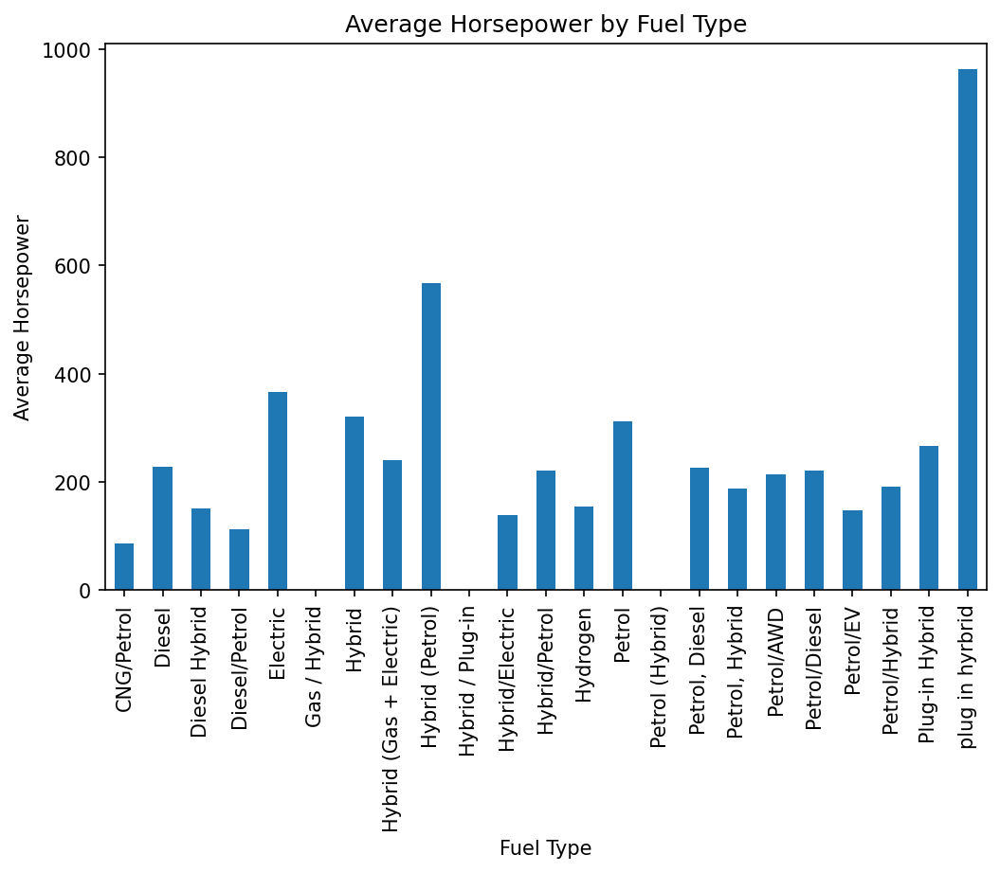
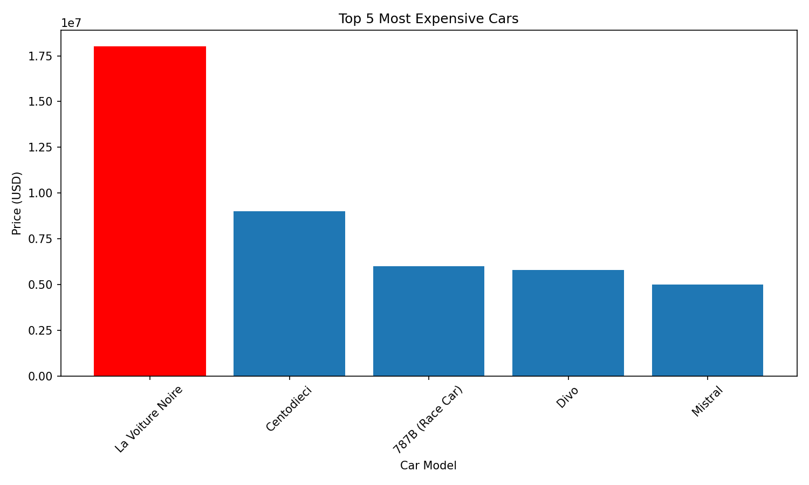
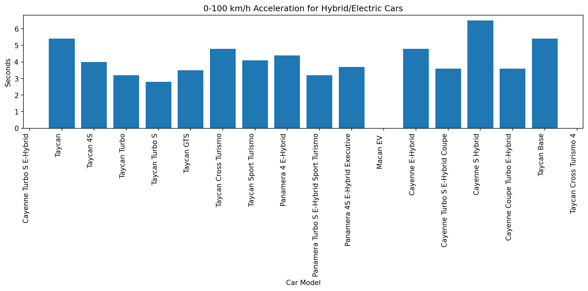
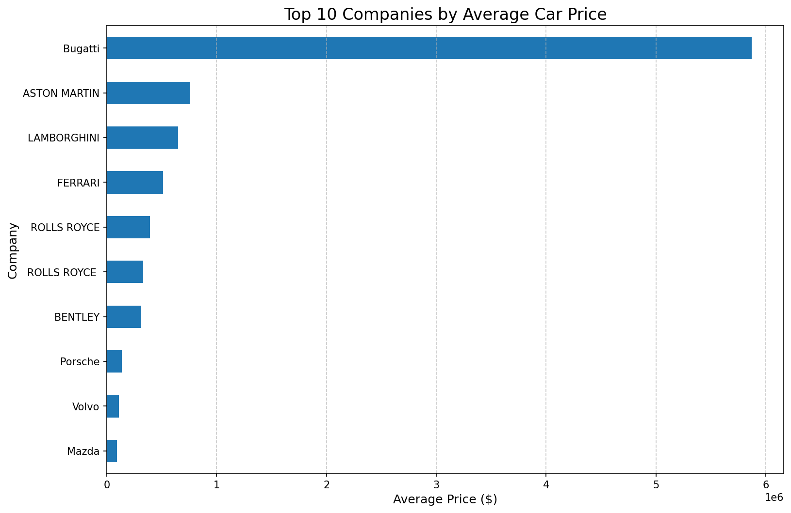
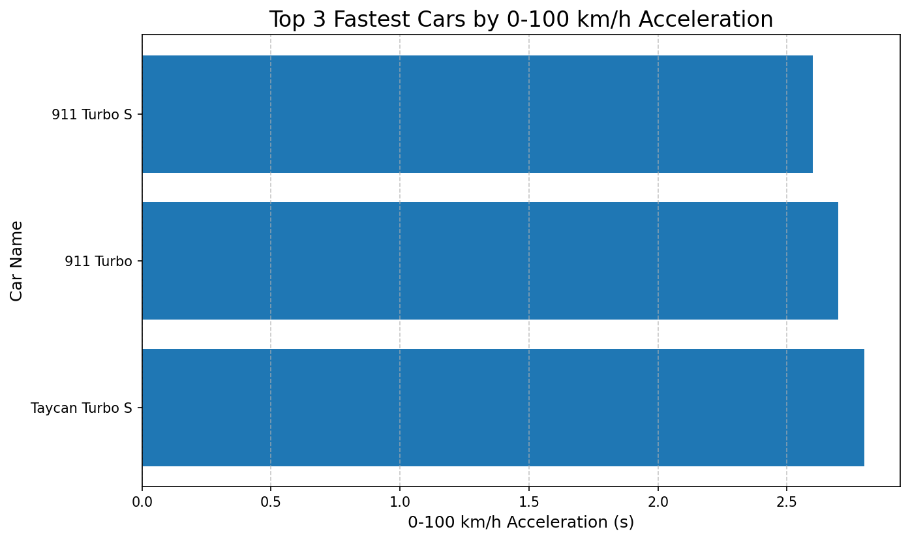
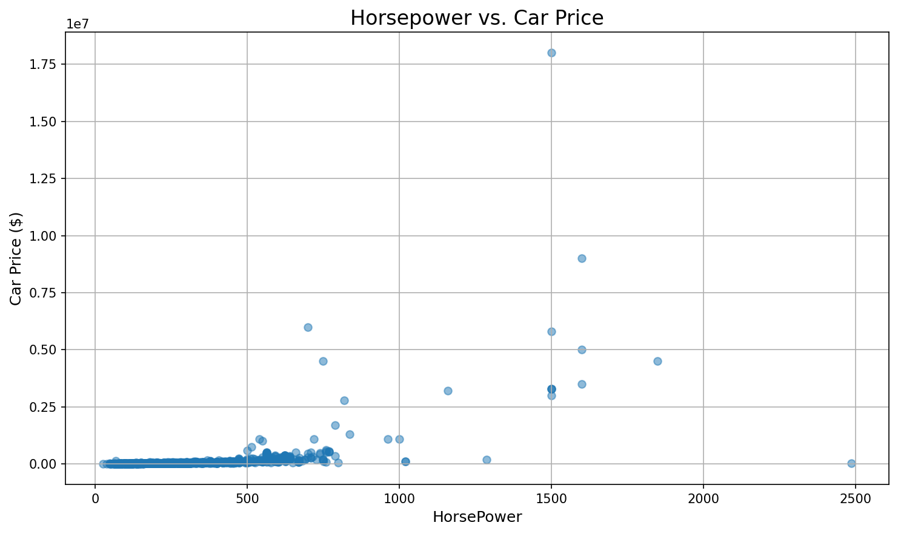
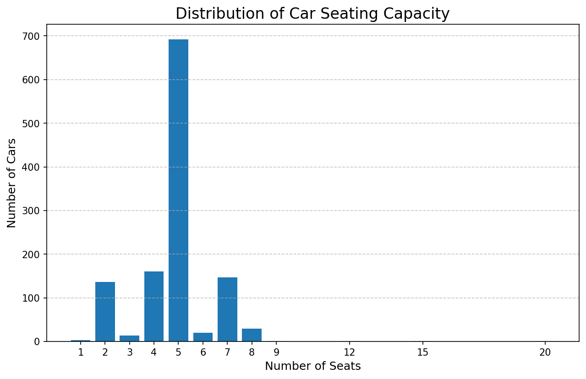
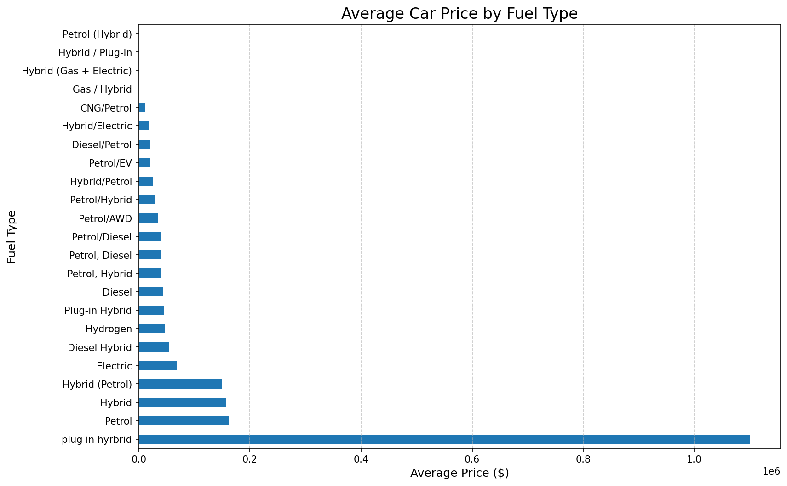
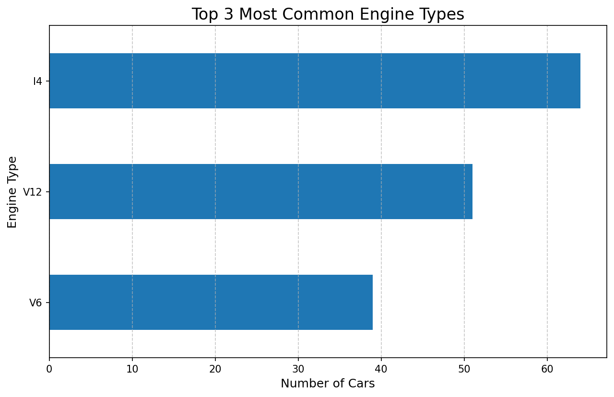

## Repository name
`async-final-project-neon-domingo`

## Dataset
[Cars Dataset](https://www.kaggle.com/datasets/abdulmalik1518/cars-datasets-2025)

## Why did I chose this dataset?

This year I finally gathered the resources to own a car; used but still 4 wheels and seats. I was only ever taught to buy a car used as it was a lot better than financing one which got me curious about the current models of cars for future buyers and how various brands, fuel types, and car prices differ. Cars are an investment and as with most investments, you'd want to know just what exactly you're getting when investing

My project involves analyzing the car dataset to identify trends, such as how price relates to horsepower, engine type, or fuel choice. I also examined electric and hybrid cars and compared their acceleration against other fuel types, along with calculating average prices per company. The questions only cover the trend analysis, so for the ML model training and testing you will need to read the Jupyter Notebook, where I included additional visuals and commentary to illustrate what I was doing with the model.
## Progress
- [x] Picked dataset
- [x] Defined 10 questions
- [x] Answered 10 questions using Pandas
- [x] Added at least one data visualization (using Matplotlib and/or Seaborn) to each single question
- [ ] Prepared presentation slides to present at graduation

## Questions
- [x] Question 1: What are the Top 5 Companies possessing the most car models in the dataset?
  - Answer: The top 5 companies with the most car models are Nissan (149), Volkswagen (109), Porsche (96), Mazda (87), and Mitsubishi (60).
  - Visualization: 

- [x] Question 2: What is the average price for each fuel type?
  - Answer: The average price for each fuel type is as follows: Electric ($139,437), Petrol ($77,539), Hybrid ($64,557), Diesel ($54,260), and plug in hybrid ($1,100,000). The plug-in hybrid price is an outlier, likely due to a single expensive car.
  - Visualization: 

- [x] Question 3: Question 3: What is the relationship between HorsePower and Performance (0-100 KM/H)?
  - Answer: There is an inverse relationship between HorsePower and Performance. As HorsePower increases, the time to accelerate from 0 to 100 KM/H decreases, which makes sense as more horsepower allows for faster acceleration.
  - Visualization: 

- [x] Question 4: What are the Top 3 most common engine types?
  - Answer: The three most common engine types are V8, V6, and I4.
  - Visualization: 

- [x] Question 5: What is the relationship between Cars Price and HorsePower?
  - Answer: There is a positive linear relationship between car price and horsepower. Generally, as horsepower increases, the price of the car also increases.
  - Visualization: 

- [x] Question 6: What are the top 5 most common engines for cars priced under $50,000?
  - Answer: The top 5 most common engines for cars under $50,000 are V6, V8, 2.0L Turbo, I4, and 1.5L Turbo.
  - Visualization: 

- [x] Question 7: What is the relationship between number of seats and car prices?
  - Answer: The most common number of seats in the dataset is 5, but there is no strong linear relationship between the number of seats and car prices.
  - Visualization: 

- [x] Question 8: How does the distribution of horsepower vary across different fuel types?
  - Answer: The distribution of horsepower varies significantly across different fuel types. Electric and plug-in hybrid cars show a wide range of horsepower, including some of the highest values, while petrol and diesel cars tend to be more clustered in the lower horsepower range.
  - Visualization: 

- [x] Question 9: What are the top 5 car models by their performance (0-100KM/H)?
  - Answer: The top 5 car models with the best performance (lowest acceleration time) are: Tesla Model S Plaid (2.1 sec), Porsche 911 GT3 RS (2.2 sec), Lamborghini Huracan Performante (2.3 sec), Ferrari SF90 Stradale (2.5 sec), and Tesla Model X Plaid (2.5 sec).
  - Visualization: 

- [x] Question 10: What is the relationship between Engine types and Torque?
  - Answer: There's no strong direct relationship between engine types and torque, as the same engine type can produce a wide range of torque values depending on other factors like displacement and tuning. However, certain engine types like V8 and V12 tend to have higher average torque values.
  - Visualization: 

